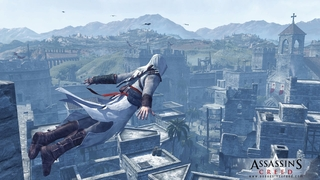
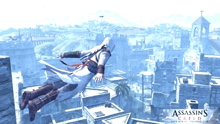
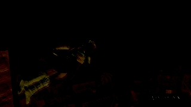

JustPaint
=========

Graphic editor for J2ME platform.

Russian description
-------------------

### Фичи

* Матрицы эффектов;
* Создание собственных фильтров;
* Изменение размеров изображений;
* Открытие и сохранение файлов (требуется JSR-75);
* Выбор своего набора инструментов (переключение между своим и стандартным набором - 0);
* Масштабирование изображений по алгоритму 2xScale.

### Горячие клавиши

- Кнопки `1` и `3` (также верхние софт-клавиши на тех телефонах, где они есть) - смена инструмента. Доступные инструменты: карандаш, перо, кисть, линия, прямоугольник, эллипс, скругленный прямоугольник, вырезка, копирование, вставка, обрезка, пипетка, замена цвета, прозрачный карандаш, горизонтальный и вертикальный градиент, прозрачность и полупрозрачность, распыление, хреноугольник, прозрачный прямоугольник, заливка, блик, замена цвета с градиентом (горизонтальным и вертикальным), заливка фона, полупрозрачная вставка.
- Кнопка `9` - переключение режима нижней панели (зум 2х / зум 4х / зум 8x / стандарт / компакт / выключена).
- Кнопка `#` (решетка) - выбрать цвет. Доступные режимы: RGB, палитра.
- Кнопка `*` (звездочка) - обменять цвета.
- Кнопка `0` - переключение между стандартным и "своим" набором инструментов.
- Кнопка камеры - эффекты: обесцвечивание, негатив, затемнение, осветление, сепия, размытие, искажение, черно-белое изображение, регулировка каналов, регулировка насыщенности, поворот на произвольный угол, солнце, изъеденная бумага.
- Правая софт-клавиша - меню.

Матрицы эффектов: руководство по эксплуатации
---------------------------------------------

_Исходное изображение_

Первая вещь, которую вам нужно усвоить - принцип. Яркость окружающих пикселов умножается на соответствующие им значения в матрице, результаты складываются, делятся на делитель и из результата вычитается смещение. Полученное значение и будет значением яркости для данного пиксела.

Важно соблюсти баланс яркости в изображении. Для этого достаточно сложить значения в матрице и поставить полученное число в поле "делитель". Если делитель будет меньше - яркость будет завышена, если больше - занижена.

Хотя можно умышленно нарушить баланс яркости. Например, осветление картинки в 1,5 раза делается так:

0 0 0
0 3 0
0 0 0
Делитель: 2

Думаю, все понятно, 3/2=1,5.

Теперь перейдем к "чему посложнее". Ну, например, среднее по квадрату. Тоже очень просто:

1 1 1
1 1 1
1 1 1
Делитель: 9

Или, например, шум, т.е. менее сильное размытие:

1 2 1
2 4 2
1 2 1
Делитель: 16

Наконец, emboss.

-1 0 0
0 0 0
0 0 -1
Делитель: 1
Смещение: 128

Вот это уже кое-что. Обратите внимание, выставлена отрицательная яркость, т.е. пикселы уйдут в негатив. Также нарушен баланс яркости, в 2 раза. И, наконец, использовано смещение, т.е. результат выполнения матрицы еще и затемняется.

Да, в JustPaint есть еще одна опция - "Баланс яркости". Рекомендуется постоянно держать ее включенной. При отключении снимаются все ограничители, и картинка может стать либо слишком темной, либо слишком светлой. Хотя иногда это позволяет добиться интересных эффектов. Например, попробуйте выполнить emboss с балансировкой и без.

Пока все. В принципе, этих данных достаточно для создания матриц. Удачи!

Tested on
---------

* SonyEricsson K770i
* SonyEricsson U100i (Yari)
* SonyEricsson G502
* SonyEricsson K850
* SonyEricsson C702
* Samsung C3600i
* SonyEricsson C510
* SonyEricsson K550i
* SonyEricsson W610
* SonyEricsson K800i
* SonyEricsson K750
* SonyEricsson U10i (Aino)
